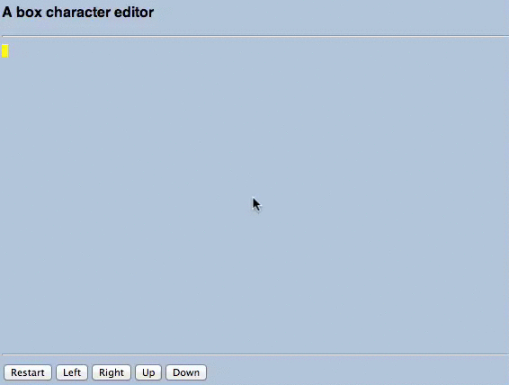

Box drawing character utility
======================

## About

Simple utility to make it easier to create lines, line charts, org charts using plain text characters.

## Usage

Here are some examples of what you can create:

              +--+                                                              
              |  |                                                              
              ++++                                                              
               ||                                                               
         +==+==++==+==+                                                         
         +==+      +==+                                                         
            |      |                                                            
            |      |                                                            
            +=+===++                                                            
            | +-+ |                                                             
            | | | |                                                             
            | | | |                                                             
            +-+ +-+                                                             

or

                                                                               
      +====+=============+===================+                                  
      |    |             |                   |                                  
      +----+-------------+-------------------+                                  
      |    |             |                   |                                  
      |    |             |                   |                                  
      |    |             |                   |                                  
      +====+=============+===================+                                  
                          
or
                                                                                                                                                              
                   +---------+                                                                                                                                  
                   |         |                                                                                                                                  
                   +----+----+                                                                                                                                  
                        |                                                                                                                                       
         +--------------+------------+                                                                                                                          
      +--+--+        +--+--+      +--+--+                                                                                                                       
      |     |        |     |      |     |                                                                                                                       
      +--+--+        +--+--+      +--+--+                                                                                                                       
         |   +----+     | +----+     | +----+                                                                                                                   
         +---+    |     +-+    |     +-+    |                                                                                                                   
         |   +----+     | +----+     | +----+                                                                                                                   
         |              |            |              
         |   +----+     | +----+     | +----+                                                                                                                   
         +---+    |     +-+    |     +-+    |                                                                                                                   
         |   +----+     | +----+     | +----+                                                                                                                   
         |              |            |              
         |   +----+     | +----+     | +----+                                                                                                                   
         +---+    |     +-+    |     +-+    |                                                                                                                   
             +----+       +----+       +----+                                                                                                                   
                                                    

## Instructions

To try it go to http://ogt.github.com/boxchareditor
and then use your keyboard arrows to move the yellow cursor around (you may need to click on it to give to the window focus).

When you want to draw a line, keep the `SHIFT` key pressed while you move the arrows.
The line will be using the `-` dash character to draw the line when moving horizontally and the  `|` bar character 
to draw vertical lines.  Keep the `SHIFT`  and `COMMAND` (for macs) or `META` (for pcs) keys pressed to draw a double line using the `=` equal character.

When a horizontal and a vertical line cross it uses the `+` plus character. 
There is no undo, but you can erase what you drew by pressing the `ALT` key while you move. Erasing is "smart", i.e., it looks
at its neighboring cells and fixes anything that need to be fixed after the erase.

Pressing the Restart button does the obvious. 
There are a few configuration variables that you can change - you will need to press Restart for them to take effect.
One of the configuration variables is `speed` - speed 2 means that a any arrow key pressed is repeated 2 times - so the 
moving/drawing happens faster.

The drawing happens against an invisible canvas - you control the width and height of it through configuration parameters.
You cannot draw outside the canvas. 
For fonts you shoud probably stick to fixed width fonts.

The purpose of the utility is to allow you to draw relative complex tables/org charts 
that you then copy and paste into your editor.

## Installation 

To run locally:

    > hub clone ogt/boxchareditor && cd boxchareditor
    > npm install
    > open index.html

To make local changes:

    > hub clone ogt/boxchareditor && cd boxchareditor
    > npm install
    > # make any changes you want
    > make bundle  #recreates static/bundle.js
    > npm test # confirm tests run fine
    > open index.html

If you want an enhancement feel free to add an issue.

## Acknowledgments

The animated gif was created using [keycastr](https://github.com/sdeken/keycastr/) , 
Quicktime Player and an [online image converter](http://image.online-convert.com/convert-to-gif)
following the advice of [github.com/f](https://github.com/f) @ [HN](https://news.ycombinator.com/item?id=5613652).

